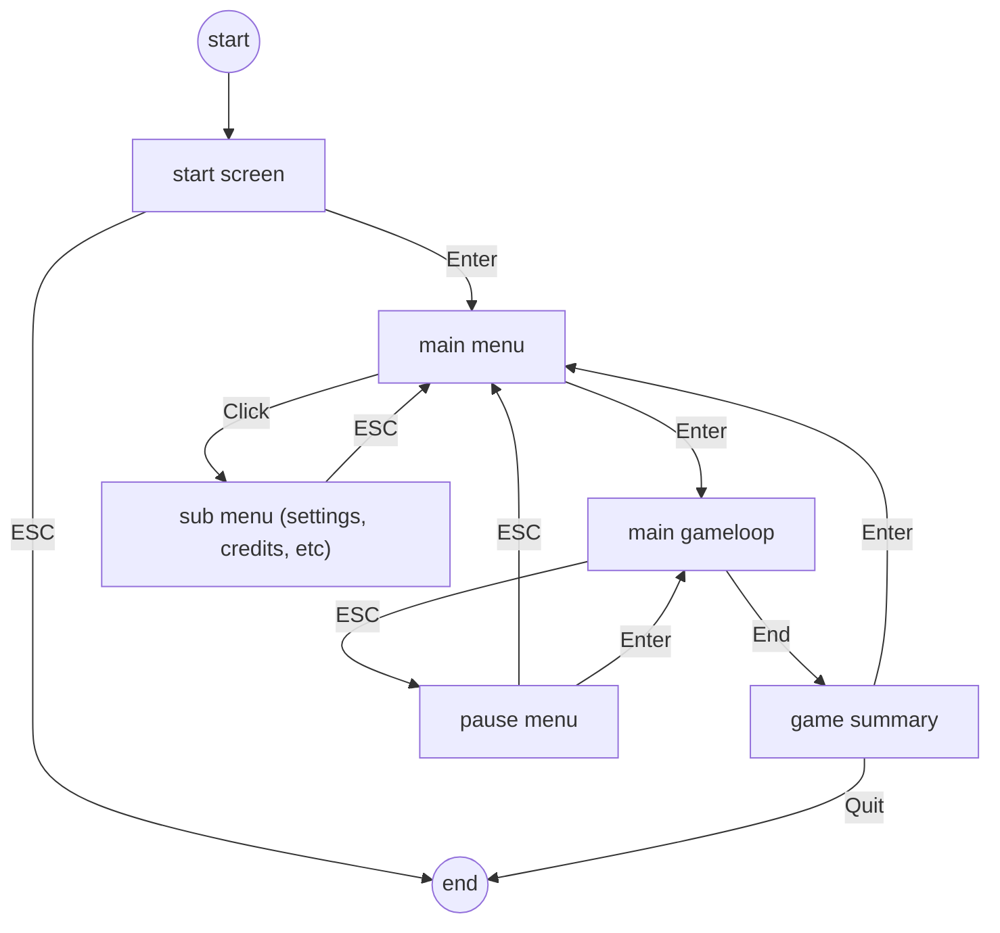

# Connect-4

I'm making this game to learn about the basics of game development in pygame. The game in itself is quite basic but I want to learn how to develop the structure around it

## Menu Structure

A visualisation of the structure I want to build to have an effective sequence of menus.

# Requirements

- Screens
  - ✅Start Screen
  - ✅Start Menu
  - Settings Menu
  - Leaderboard Menu
  - Game Screen
  - Pause Menu
  - Credits Menu
- Features
  - Leaderboard (ranked by how many games a user has won)
  - Ability to choose Users to play with (maybe more than 2)
  - Place marks by clicking on slot / by clicking on column the mark should be placed in
  - Reset Function
  - Manage Users
  - Falling Animation of the marks
  - Different Difficulties with different grids
  - Center the grid in the screen based on resolution
  - Configure Resolution and Color Theme
- Optional Ideas
  - AI player for a single player
  - non-local Multiplayer  
